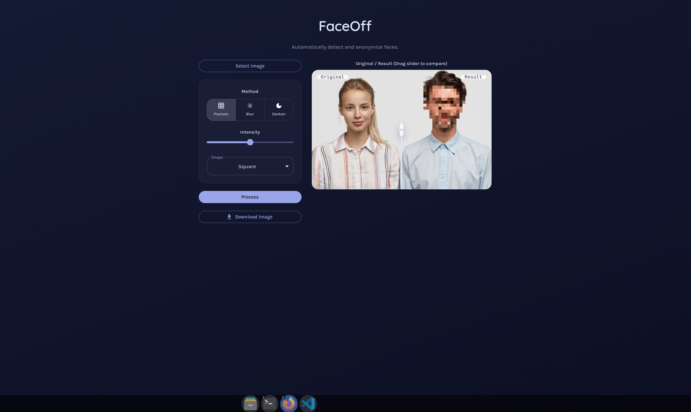
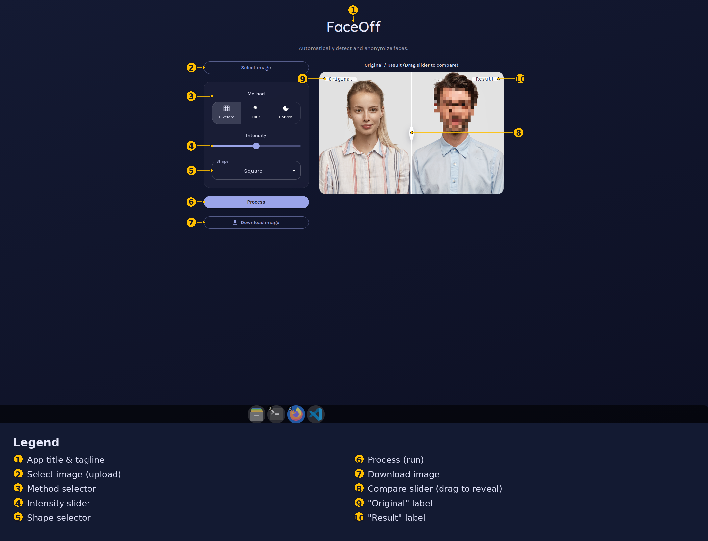

# FaceOff

Automatically detect and anonymize faces in photos — pixelate, blur, or darken, with adjustable intensity and mask shape. Upload a photo, tweak the settings, and drag the before/after slider to compare.



## Features

- **Automatic face detection** using OpenCV's Haar cascade classifier — no manual selection needed.
- **Three anonymization methods**: pixelate, Gaussian blur, or darken.
- **Adjustable intensity** (0–100) and **mask shape** (square or circle).
- **Before/after compare slider** to inspect the result.
- **One-click download** of the anonymized image.

<details>
<summary>Annotated UI walkthrough</summary>



</details>

## Tech stack

| Layer    | Stack |
|----------|-------|
| Frontend | React 19, TypeScript, Vite, MUI |
| Backend  | FastAPI, OpenCV (`opencv-python-headless`), NumPy |
| Package managers | npm (frontend), [uv](https://docs.astral.sh/uv/) (backend) |

## Architecture

```
frontend (React/Vite, :5173)  ──POST /upload──▶  backend (FastAPI, :8000)
                                                        │
                                                   OpenCV Haar cascade
                                                   detects faces, applies
                                                   the chosen effect
                                                        │
                                                        ▼
                                              uploads/<uuid>.<ext>
                                              served at GET /uploads/<file>
```

The backend never persists the original upload — the image is decoded in memory, faces are anonymized, and only the **result** is written to disk under a random UUID filename.

## Getting started

### Prerequisites

- Node.js 20+
- Python 3.13+ and [uv](https://docs.astral.sh/uv/getting-started/installation/)

### 1. Backend

```bash
cd backend
uv sync
cp .env.example .env   # adjust CORS_ORIGINS / UPLOAD_DIR / MAX_UPLOAD_BYTES if needed
uv run backend
```

The API is now available at `http://localhost:8000` (interactive docs at `/docs`).

### 2. Frontend

```bash
cd frontend
npm install
cp .env.example .env   # points at the backend, defaults to http://localhost:8000
npm run dev
```

The app is now available at `http://localhost:5173`.

### Or: run both at once

`./start.sh` opens a terminal tab for each service (requires a supported terminal emulator: gnome-terminal, konsole, xfce4-terminal, tilix, alacritty, kitty, or xterm).

### Or: Docker

```bash
docker compose up --build
```

This builds and runs both services — frontend on `http://localhost:80`, backend on `http://localhost:8000`, with uploaded results persisted in a named Docker volume. Override defaults via a `.env` file at the repo root (see `docker-compose.yml` for the variables it reads: `CORS_ORIGINS`, `MAX_UPLOAD_BYTES`, `VITE_API_URL`).

## API reference

### `POST /upload`

Multipart form upload. Runs face detection and anonymization, and returns the result filename.

| Field       | Type   | Default     | Notes |
|-------------|--------|-------------|-------|
| `file`      | file   | required    | Must have an `image/*` content type |
| `method`    | string | `pixelate`  | `pixelate` \| `blur` \| `darken` |
| `intensity` | int    | `50`        | `0`–`100` |
| `shape`     | string | `square`    | `square` \| `circle` |

**Response** `200 OK`
```json
{ "filename": "3f9c...ab.jpg", "faces_detected": 1 }
```

Errors: `400` (not an image / undecodable image), `413` (exceeds `MAX_UPLOAD_BYTES`).

### `GET /uploads/{filename}`

Serves a previously generated result image.

### `GET /health`

Liveness check, returns `{"status": "ok"}`.

## Configuration

| Variable          | Service  | Default                      | Description |
|-------------------|----------|-------------------------------|-------------|
| `CORS_ORIGINS`    | backend  | `http://localhost:5173`       | Comma-separated list of allowed origins |
| `UPLOAD_DIR`      | backend  | `<repo-root>/uploads`         | Where result images are written |
| `MAX_UPLOAD_BYTES`| backend  | `10485760` (10 MB)            | Rejects larger uploads with `413` |
| `VITE_API_URL`    | frontend | `http://localhost:8000`       | Backend base URL the SPA calls |

## Testing & linting

```bash
# Backend
cd backend && uv run pytest

# Frontend
cd frontend && npm run lint && npm run build
```

## Known limitations

- Face detection uses a Haar cascade (fast, dependency-free) rather than a deep-learning detector, so it can miss faces at extreme angles, low light, or partial occlusion, and will occasionally false-positive on non-face regions.
- Result images accumulate in `UPLOAD_DIR` with no automatic expiry — for a public deployment, prune old files periodically (e.g. a cron job or lifecycle rule on the mounted volume/bucket).
- There's no auth, rate limiting, or per-user storage isolation — anyone who can reach the API can upload images and anyone with a result filename can fetch it. Put it behind your own auth/rate-limiting layer before exposing it publicly at scale.

## License

[MIT](LICENSE)
